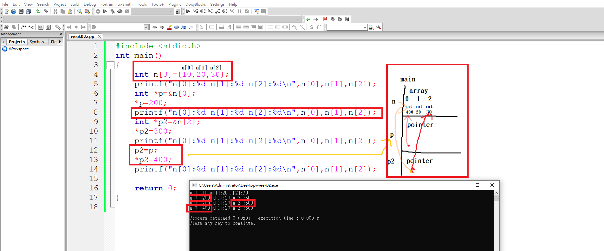

# 2020-CCE

#第01週的實習課程式

## 第一題 進階題:分式化簡

```C
#include <stdio.h>
int main()
{
	int m,n,i;
	scanf("%d%d",&m,&n);  /*輸入分母及分子*/
	for(i=m;i>=1;i--)
	{
		if((m%i==0) && (n%i==0))  /*分母不可為0*/
		{
			m=m/i;
			n=n/i;
		}
	}
	printf("%d %d\n",m,n);
}
```

## 第二題 進階題:讀入整數反序列印

```C
#include <stdio.h>
int a[10]={};
int main()
{
	for(int i=0;i<10;i++)
	{
		scanf("%d",&a[i]);
		if(a[i]==0)  /*輸入0才會結束*/
		{
			 break;
		}
	}
	for(int i=9;i>=0;i--)  /*不超過10個正整數，並且反轉數字*/
	{
		if(a[i]!=0)
		{
			printf("%d ",a[i]);
		}
	}
	printf("\n");
}
```
## 第三題 進階題:A的B次方函數

```C
#include <stdio.h>
int MYPOWER(int a,int b)
{
	int ans=1;
	for(int i=1;i<=b;i++)
	{
		ans=ans*a;
	}
	return ans;
}
int main(void)
{
	int a,b;
	scanf("%d%d",&a,&b);
	printf("[%d]",MYPOWER(a,b));
	return 0;
}
```

## 第四題 進階題:漸增數列相增

```C
#include <stdio.h>
int main()
{
	int n,ans=0;
	scanf("%d",&n);
	for(int i=1;i<=n;i++)
	{
		ans=ans+(i-1)*i;
	}
		printf("%d\n",ans);
}
```

## 第五題 基礎題:找零錢

```C
#include <stdio.h>
int main()
{
	int n;
	scanf("%d",&n);
	int coin50=n/50;
	int coin5=(n%50)/5;
	int coin1=(n%5);
	printf("%d=50*%d+5*%d+1*%d\n",n,coin50,coin5,coin1);
}
```

## 第六題 基礎題:因數個數

```C
#include <stdio.h>
int main()
{
	int n;
	scanf("%d",&n);
	int space=0;
	for(int i=1;i<=n;i++)
	{
		if(n%i==0)  /*如果能整除就是因數*/
		{
			space++;
		}
	}
	printf("%d\n",space);
}
```

## 第七題 基礎題:找倍數

```C
#include <stdio.h>
int a[10]={};
int main()
{
	int space=0;
	int n;
	for(int i=0;i<10;i++)  /*連續輸入10個整數*/
	{
		scanf("%d",&a[i]);
		if(a[i]%3==0)  /*如果能整除3就是因數*/
		{
			space++;
		}
	}
	printf("%d\n",space);
}
```

## 第八題 基礎題:整數轉換為等級

```C
#include <stdio.h>
int main()
{
	int n;
	scanf("%d",&n);
	if(n>=90) /*大於90分*/
	{
		printf("A\n");
	}
	else if(n>=80) /*80分以上，90分以下*/
	{
		printf("B\n");
	}
	else if(n>=60) /*60分以上，80分以下*/
	{
		printf("C\n");
	}
	else printf("F\n"); /*低於60分以下的*/
}
```

#第02週 程式設計二上課內容

## 1. 試著使用指標 *p , 把變數n1 的值改掉

```C
#include <stdio.h>
int main()
{
    int n1=10,n2=20,n3=30;
    printf("n1:%d n2:%d n3:%d\n",n1,n2,n3);
    int *p=&n1;
    *p=200;
    printf("n1:%d n2:%d n3:%d\n",n1,n2,n3);
    return 0;
}
```

## 2. 試著使用指標 *p2 , 把變數n3 的值改掉

```C
#include <stdio.h>
int main()
{
    int n1=10,n2=20,n3=30;
    printf("n1:%d n2:%d n3:%d\n",n1,n2,n3);
    int *p=&n1;
    *p=200;
    printf("n1:%d n2:%d n3:%d\n",n1,n2,n3);
    int *p2=&n3;
    *p2=300;
    printf("n1:%d n2:%d n3:%d\n",n1,n2,n3);
    return 0;
}
```

## 3. 試著先 p2=p1, 然後 *p2=400, 再印出來。

```C
#include <stdio.h>
int main()
{
    int n1=10,n2=20,n3=30;
    printf("n1:%d n2:%d n3:%d\n",n1,n2,n3);
    int *p=&n1;
    *p=200;              /*p1裡面放的是n1的住址 &n1*/
    printf("n1:%d n2:%d n3:%d\n",n1,n2,n3);
    int *p2=&n3;
    *p2=300;             /*p2裡面放的是n3的住址 &n3*/
    printf("n1:%d n2:%d n3:%d\n",n1,n2,n3);
    p2=p;                /*p2叛逃，改存p1裡面的東西*/
    *p2=400;
    printf("n1:%d n2:%d n3:%d\n",n1,n2,n3);
    return 0;
}
```

## 4.現在改用陣列 int n[3]={10, 20, 30}, 再用指標, 去改裡面的值

```C
#include <stdio.h>
int main()
{
    int n[3]={10,20,30};
    printf("n[0]:%d n[1]:%d n[2]:%d\n",n[0],n[1],n[2]);
    int *p=&n[0];
    *p=200;
    printf("n[0]:%d n[1]:%d n[2]:%d\n",n[0],n[1],n[2]);
    int *p2=&n[2];
    *p2=300;
    printf("n[0]:%d n[1]:%d n[2]:%d\n",n[0],n[1],n[2]);
    p2=p;
    *p2=400;
    printf("n[0]:%d n[1]:%d n[2]:%d\n",n[0],n[1],n[2]);

    return 0;
}
```


#第03週的實習課程式

## 第一題 進階題:大小寫轉換

```C
#include <stdio.h>
#include <string.h>
int main()
{
	char a[10];
	scanf("%s",&a);
	int s=strlen(a);
	for(int i=0;i<=(s-1);i++)
{
	if(a[i]>='A' && a[i]<='Z')
	{else if(a[i]>='a' && a[i]<='z')
	{
		a[i]-=32;
	}
}
printf("%s\n",a);
}
```
## 第二題 進階題:漸增數列相加

```C
#include <stdio.h>
int main()
{
	int n,i,ans=0;
	scanf("%d",&n);
	for(i=2;i<=n;i++)
	{
		ans=ans+(i-1)*i;
	}
	printf("%d",ans);
	printf("\n");
}
```
## 第三題 進階題:計算陣列的平方值

```C
#include <stdio.h>
int main()
{
	int a[10],i,n;
	scanf("%d ",&n);
	for(i=0;i<=n-1;i++)
	{
		scanf("%d",&a[i]);
		printf("%d,",a[i]*a[i]);
	}
	printf("\n");
}
```
## 第四題 進階題:2進位轉10進位

```C
#include <stdio.h>
int main()
{
	int n=0;
	char c;
	scanf("%c",&c);
	while(c=='0' ||c=='1')
	{
		n=(n<<1)+c-'0';
		scanf("%c",&c);
	}
	printf("%d\n",n);
}
```
## 第五題 基礎題:計算幾週與幾天

```C
#include <stdio.h>
int main()
{
	int a,week,day;
	scanf("%d",&a);
	week=a/7;
	day=a%7;
	printf("%d %d\n",week,day);
}
```
## 第六題 基礎題:計程車資計算

```C
#include <stdio.h>
int main()
{
	int n,m,cost;
	scanf("%d",&n);
	if(n<=2000) cost=100;
	else
	{
		m=n-2000;
		if(m%500==0) cost=100+(m/500)*5;
		else cost=100+((m/500)+1)*5;
	}
	printf("%d\n",cost);
}
```
## 第七題 基礎題:兩數間可被5整除的整數

```C
#include <stdio.h>
int main()
{
	int min,max,i,num;
	scanf("%d%d",&min,&max);
	if(min>max)
	{
		num=min;
		min=max;
		max=num;
	}
	for(i=min;i<=max;i++)
	{
		if(i%5==0)
		{
			printf("%d\n",i);
		}
	}
}
```

## 第八題 基礎題:整數間最大距離

```C
#include <stdio.h>
int main()
{
	int a,b,c;
	scanf("%d%d%d",&a,&b,&c);
	int max,min;
	if(a>b && a>c)
	{
		max=a;
	}
	else if(b>a && b>c)
	{
		max=b;
	}
	else if(c>a && c>b)
	{
		max=c;
	}
	if(a<b && a<c)
	{
		min=a;
	}
	else if(b<a && b<c)
	{
		min=b;
	}
	else if(c<a && c<b)
	{
		min=c;
	}
	printf("%d\n",max-min);
}
```

#第03週 程式設計二上課內容
## 1.老師示範 int *p = &a[2]; *p=222; p = p + 2; *p = 666;  到底發生了什麼事? 請畫圖解釋
```C
#include <stdio.h>
int a[5]={0,10,20,30,40};
int main()
{
    int *p=&a[2];
    *p=222;

    p=p+2;
    *p2=666;
}
```


## 2.老師示範 int *p = &a[2]; *p=222; p = p + 2; *p = 666; p--; *p=555;

```C
#include <stdio.h>
int a[5]={0,10,20,30,40};
void printAll()
{
    for(int i=0;i<5;i++)
    {
        printf("%d ",a[i]);
    }
    printf("\n");
}
int main()
{
    int *p=&a[2];
    *p=222;
            printAll();

    p=p+2;
    *p2=666;
            printAll();

    p--;
    *p2=555;
            printAll();
}
```


## 3.請畫出 指標的宣告 int *p=&a[2]; 及指標的使用 p = &a[2] 

```C
#include <stdio.h>
int a[10]={0,10,20,30,40,50,60,70,80,90};
void printAll()
{
    for(int i=0;i<10;i++)
    {
        printf("%3d ",a[i]);
    }
    printf("\n");
}
int main()
{
    int *p=&a[2];
    *p=200;
            printAll();

    int *p2=p+4;
    *p2=666;
            printAll();

    p2--;
    *p2=555;
            printAll();
}
```


## 4.今天教最重要的是 malloc(), 它是什麼呢? 會幫你準備 memory (allocate memory)。請用老師傳給你的圖, 自己再畫一次, 增加印象。

```C
#include <stdio.h>
#include <stdlib.h>
int a[10];
int main()
{
    int b[10];
    int *p=(int*) malloc(sizeof(int)*10 );
}
```


#第04週 程式設計二上課內容
## 1.請跟著老師練習: struct DATA { float x, y, z; }; 結構的宣告、定義
```C
#include <stdio.h>
struct DATA
{
    float x,y,z;
}
int main()
{

}
```
